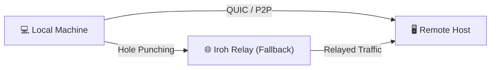

# Irosh

**Secure SSH-like remote access without open ports, NAT issues, or public IPs.**

[](https://crates.io/crates/irosh)
[](https://docs.rs/irosh)
[](#license)

Powered by [Iroh](https://iroh.computer) peer-to-peer transport with built-in identity and TOFU (Trust On First Use) security.

---

## 🚀 Installation (CLI)

Install the unified `irosh` binary for standard interactive usage:

**Linux / macOS / Android (Termux)**:
```bash
curl -fsSL irosh.pages.dev/install | sh
```

**Windows (PowerShell)**:
```powershell
iwr irosh.pages.dev/ps | iex
```

---

## ⚡ Quick Start

1. **On the Remote Machine**: Start the server to generate a connection ticket:
   ```bash
   irosh host
   ```
2. **On Your Local Machine**: Connect using that ticket (or a saved alias):
   ```bash
   irosh <TICKET_OR_ALIAS>
   ```
3. **Inside the Shell**: Start a line with `~` for local escape commands:
   - `~?` or `~help`: View all available local commands.
   - `~~`: Send a literal `~` character to the remote shell.
   - `~C`: Open the `irosh>` local command prompt.
   - `~put [-r] <local> [remote]`: Upload a file or directory to the remote.
   - `~get [-r] <remote> [local]`: Download a file or directory from the remote.

### 📦 Management Commands
- **Save a peer**: `irosh peer add <alias> <ticket>`
- **List saved peers**: `irosh peer list`
- **Background Service**: `irosh system install` (Works on Linux, macOS, and Windows)
- **Identity**: `irosh identity` (View your Node ID and SSH host keys)

---

## 💎 Why Irosh?

Traditional SSH is built for the "Server-Client" world of public IPs and open ports. **Irosh is built for the P2P world.**

- ✅ **No Open Ports**: Works entirely via P2P hole-punching. No firewall rules needed.
- ✅ **NAT Traversal**: Connect to machines behind home routers or strict corporate firewalls.
- ✅ **Unified CLI**: A single, professional binary for all your P2P SSH needs.
- ✅ **Secure by Default**: Built-in QUIC encryption and Ed25519 peer identity.
- ✅ **Premium CLI UX**: Visual progress bars, persistent history, Tab completion, and `Ctrl+C` cancellation for transfers.
- ✅ **Fast & Stable**: Non-blocking I/O and lazy channel initialization for a snappy feel.

---

## 🎯 Ideal For...

- **Home Labs**: Access machines behind CGNAT (like Starlink or mobile hotspots) without a VPN.
- **Remote Development**: Connect to your home workstation from a coffee shop without port forwarding.
- **IoT & Edge**: Manage remote devices deployed in restricted or cellular networks.
- **One-off Support**: Help a friend troubleshoot by connecting to their machine via a one-time ticket.

## ⚙️ How it Works

Irosh uses the Iroh network to establish direct peer-to-peer QUIC connections. It bypasses firewalls using state-of-the-art hole-punching and falls back to a global relay network only when direct connectivity is impossible.



---

## 🛠 Developer Integration (Library)

The `irosh` crate is designed as a library first. Transport, protocol, and framing are strictly independent of CLI assumptions.

### 1. Add to your project
```bash
cargo add irosh
```

### 2. Implementation Example
```rust,no_run
use irosh::{Client, ClientOptions, SecurityConfig, Server, ServerOptions, StateConfig};

async fn run() -> Result<(), Box<dyn std::error::Error>> {
    // 1. Bind a P2P server
    let (ready, server) = Server::bind(
        ServerOptions::new(StateConfig::new("/tmp/irosh-server".into()))
    ).await?;

    tokio::spawn(server.run());

    // 2. Connect from a P2P client
    let mut session = Client::connect(
        &ClientOptions::new(StateConfig::new("/tmp/irosh-client".into())),
        ready.ticket().to_string().parse()?
    ).await?;

    // 3. Execute remote commands via Iroh transport
    session.exec("uname -a").await?;
    Ok(())
}
```

For the complete API reference, visit [docs.rs/irosh](https://docs.rs/irosh).

### 3. Feature Flags
- `server`: enables server-side API (includes PTY logic).
- `client`: enables client-side API.
- `storage`: enables trust and identity persistence.
- `transport`: enables Iroh transport and protocol types.

---

## ❓ How is this different from SSH?

| Feature | Standard SSH | Irosh |
| :--- | :--- | :--- |
| **Addressing** | Static IP / DNS / Port 22 | Server-generated Tickets |
| **Connectivity** | Public IP / Port Forwarding | NAT Hole-punching (Anywhere) |
| **Identity** | Manual Key Management | Built-in Ed25519 Peer IDs |
| **Trust** | `known_hosts` file | TOFU (Trust On First Use) |
| **Relays** | Manual Jump-host/VPN | Automatic Iroh Relay Network |

---

## 📚 Documentation & History

- [**Architecture**](docs/architecture.md): The separation of transport, session, and shell state.
- [**Security**](docs/security.md): Cryptographic TOFU access policy and host key pinning.
- [**Protocol**](docs/protocol.md): Custom side-stream framing for metadata and file transfers.
- [**Changelog**](CHANGELOG.md): Full history of project updates and releases.

---

## License

Licensed under [MIT](LICENSE-MIT) or [Apache-2.0](LICENSE-APACHE).
