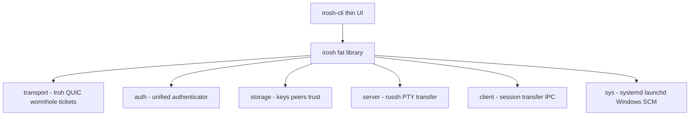

# Irosh Project Assessment & Brainstorming

> **Date:** 2026-05-31
>
> An honest architecture review, ratings, retrospective on design decisions, and brainstorming ideas for future development. Written after a full codebase exploration ahead of the v0.4.0 release.

---

## Overall Read on the System

Irosh is **not** a thin wrapper around OpenSSH over a tunnel. It is a **real product**: native P2P transport (Iroh/QUIC), native SSH (russh), native file transfer, wormhole pairing, cross-platform daemon integration, and a library-first API with a thin CLI on top. That combination is rare, and it is the right bet for the problem being solved.

The architecture reads like someone who knew where this was going:

### What Stands Out

- **Fat library / thin CLI** — Correct for crates.io, embeddable use, and testing. Most P2P tools are CLI-only spaghetti.
- **Native server, not OpenSSH proxy** — This is the moat. Android, minimal containers, and "no OpenSSH installed" scenarios become possible.
- **Sidecar transfer protocol** instead of bolting on SCP/SFTP first — Pragmatic. Fast transfer shipped without waiting on full SFTP subsystem work.
- **Service-first design** — systemd/launchd/Windows SCM + IPC is the kind of thing people skip until v2. Done early, which matches "always-on P2P node" use cases.
- **Security thinking is real** — TOFU, stealth mode, wormhole burn-after-3-fails, Windows ACL hardening, atomic secure writes. Not security theater.
- **Test culture exists** — ~160+ tests, proptest on input/completion, integration tests for transfer and forwarding. Many solo projects have zero.

### Honest Maturity Level

**Late alpha / early beta.** Core flows work and the codebase is disciplined. What's missing is mostly **operational polish** (CI on every PR, changelog discipline, a few v0.4 gaps) and **OpenSSH parity edges** — not a rewrite.

---

## Ratings

| Dimension | Score | Notes |
|-----------|-------|-------|
| Architecture & design | **9/10** | Library-first, feature flags, clear module boundaries |
| Code quality & discipline | **8/10** | Clippy-clean, good error types, some `.ok()` swallows and audit debt |
| Feature completeness (for 0.4) | **8/10** | Shell, transfer, wormhole, daemon, local forward — strong |
| Cross-platform seriousness | **8.5/10** | Windows ConPTY + SCM is hard; it's done |
| Testing | **7.5/10** | Core library solid; sys/CLI gaps, 4 flaky ignored tests |
| Docs & release hygiene | **6/10** | Good README/rustdoc; CHANGELOG lag, stale audit docs |
| Product differentiation | **9/10** | Wormhole + identity-first + native P2P SSH is distinctive |

### Overall: **8/10** for a pre-0.4.0 solo/small-team project

That is high. Most repos at this stage are either a demo or a mess. Irosh is a product skeleton with real bones.

---

## Did You Build It the Right Way?

**Mostly yes.** The big decisions were correct:

1. **Build on Iroh, not roll your own NAT traversal** — Smart. The job is SSH + UX + trust, not QUIC engineering.
2. **Use russh, not shell out to sshd** — Correct for "Irosh is the server."
3. **Ship wormhole early** — Best UX decision in the project. Tickets are correct cryptographically; wormholes are correct humanly.
4. **Daemon + IPC from the start** — Avoids the "CLI-only tool that can't stay connected" trap.
5. **Feature-gated crate** — Downstream can embed client-only or server-only.

---

## What Could Have Been Done Differently

Hindsight, not criticism — sequencing tweaks, not rewrites:

| Choice | Alternative | Why It Might Help |
|--------|-------------|-------------------|
| Release CI only on tags | PR CI from day one | Catches Windows/Linux breakage before users do |
| CHANGELOG tracks Cargo version | Same commit as version bump | Avoids the current 0.4.0 / docs-at-0.3.0 drift |
| Protocol version in ALPN early | Extend to config/export formats too | Easier migrations at v1.0 |
| SFTP deferred (correct) | Add a **local SSH proxy listener** sooner | Lets VS Code / FileZilla work without full SFTP impl |
| Monolithic `connect` session loop | Extract a small `SessionDriver` trait | Easier to test automation / "ghost operator" later |
| Audit docs in-repo | Single `docs/STATUS.md` auto-refreshed | Stale audits erode trust |

None of these are "you should have rewritten it." They're sequencing tweaks.

---

## Brainstorming: Near-Term (Fits 0.4.x Polish)

### `irosh doctor`

One command that runs connectivity, storage permissions, service status, relay reachability, and prints fix suggestions. Users love this more than `--help`.

### Connection Profiles

`irosh connect work-laptop` backed by peer book + last-known forward rules. Peers already exist; this is UX glue.

### Session Recording (Opt-In)

Encrypted local `.cast` or asciinema for support/debug. P2P makes this more valuable (no central server holding logs).

---

## Brainstorming: Medium-Term (Differentiators, Not OpenSSH Clone)

### Invite Links, Not Just Wormhole Codes

`irosh://connect?code=apple-pie-sunset&secret=...` for one-click from mobile/desktop.

### Local SSH Gateway Mode

`irosh gateway --listen 127.0.0.1:2222 --peer <ticket>` so any SSH client can connect to a P2P peer. Huge ecosystem unlock without SFTP subsystem work.

### Mesh Visibility

`irosh peers ping` showing latency/NAT path per saved peer. Diagnostic hooks already exist; this is productized.

### Config Snapshots

Export/import (planned for v0.5.0) but also a **"bootstrap new machine"** flow: install script + import trust bundle.

---

## Brainstorming: Long-Term (Future Roadmap, Ranked by Feasibility)

1. **ProxyJump over P2P** — Chain tickets; very on-brand for "reach internal nodes."
2. **Git remote helper** (`irosh://`) — Smaller surface than full SFTP; high dev appeal.
3. **Collaborative session** — Hard, but Iroh gossip gives a path OpenSSH doesn't have.
4. **JSON output mode on all CLI commands** — Unlocks automation/agents without a new API.

See [future_roadmap.md](future_roadmap.md) for the full vision including collaborative SSH, QR pairing, git-over-irosh, AI diagnostics, and more.

---

## Brainstorming: Wild but Interesting

- **"Presence" in peer book** — Gossip heartbeat: green dot if peer's daemon is online (privacy-respecting, opt-in).
- **Ephemeral wormholes** — QR in terminal for phone-to-laptop pairing (words already exist; QR is encoding).
- **Irosh as Tailscale alternative for shell only** — Positioning: not a full mesh VPN, but "SSH that always works." Narrower, clearer story.

---

## Pre-0.4.0 Release Focus

Since v0.4.0 is still in progress, treat these as **release blockers** vs **post-0.4**:

### Before 0.4 Tag

- [x] CHANGELOG + README version sync
- [x] Release checklist: [V0_4_0_RELEASE.md](V0_4_0_RELEASE.md)
- [ ] Smoke test on all three platforms from `WINDOWS-CHECKLIST.md`
- Idle timeout and auth persistence **deferred to v0.5.0** (see [V0_5_0_ROADMAP.md](V0_5_0_ROADMAP.md))

### Immediately After 0.4

- PR CI workflow (cheap, high leverage)
- Begin work on [V0_5_0_ROADMAP.md](V0_5_0_ROADMAP.md)

---

## Bottom Line

Irosh was built the **right way** for a serious P2P SSH tool: library-first, native stack, real cross-platform service integration, and UX (wormholes) that matches the crypto. The gaps are normal pre-1.0 gaps — release hygiene, a few security audit items, OpenSSH parity at the edges — not architectural mistakes.

**Competitive advice:** Don't compete on "another SSH client." Compete on **identity-first connectivity that feels like magic** — wormhole, always-on daemon, works without ports. That's what `scratch/IROSH_DEFINITION.md` already says; the code backs it up.

---

## Related Documents

- [V0_5_0_ROADMAP.md](V0_5_0_ROADMAP.md) — post-0.4.0 stabilization plan
- [ROADMAP.md](ROADMAP.md) — overall development phases
- [future_roadmap.md](future_roadmap.md) — long-term vision
- [improvements-audit.md](improvements-audit.md) — security and quality audit
- [pre-v0.4.0-audit.md](pre-v0.4.0-audit.md) — pre-release codebase audit
- [scratch/IROSH_DEFINITION.md](../scratch/IROSH_DEFINITION.md) — product definition
