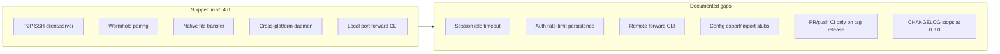
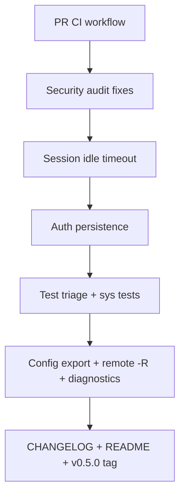

# Irosh v0.5.0: Stabilization & Production Hardening

> **Status:** Planned — to be implemented after v0.4.0 is released.
>
> This document captures the post-0.4.0 release plan. It aligns with [ROADMAP.md](ROADMAP.md) Phase 3 ("Stabilization & Polish") and the open items in [improvements-audit.md](improvements-audit.md).

## Overview

A v0.5.0 release focused on **production hardening**: close documented v0.4 gaps, fix security/quality audit items, add PR CI, and ship a few small but meaningful capabilities (config backup, richer diagnostics, remote forward CLI) that justify a minor version bump.

Irosh is already a mature P2P SSH product at v0.4.0 — wormhole pairing, native file transfer, daemon/service integration, and ~160+ tests in the core library. The biggest opportunities for v0.5.0 are not greenfield features but **closing documented gaps**, **hardening security**, and **making quality gates run before release**.

---

## Current State (What's Done vs. Open)

| Area | Status |
|------|--------|
| Core P2P SSH + transfer + wormhole | Solid |
| `Session::remote_forward()` in library | Exists — `src/client/mod.rs` |
| CLI remote forward (`-R`, `~C`) | **Not wired** — only local forward in `cli/src/commands/connect/tunnels.rs` |
| Session idle timeout | **Not implemented** (noted in `docs/improvements-audit.md`) |
| Auth `failed_attempts` persistence | **In-memory only** — `Arc<AtomicU32>` in `src/auth.rs` |
| Config export/import | **Stub** — `cli/src/commands/config.rs` prints "not yet implemented" |
| CI | **Tag-only** — `.github/workflows/release.yml`; no PR workflow |
| CHANGELOG / README | Still reference **v0.3.0** while crate is **0.4.0** |

---

## Recommended v0.5.0 Scope (4 Workstreams)

### 1. Security & Reliability Hardening (Highest Impact)

Items from `docs/improvements-audit.md` that are still open:

- **Public-key auth rate limiting** — password auth checks `failed_attempts >= 3` at `src/auth.rs` ~542; extend the same guard to `check_public_key` (~602 area) so brute-force attempts can't bypass via key auth.
- **Key material zeroization** — `src/storage/keys.rs` writes hex `String`s; switch to `zeroize`-backed buffers or raw secure writes via existing `atomic_write_secure`.
- **Silent error swallowing** — replace 16 `.ok()` discards (PTY channel writes, transfer flush, metadata subprocess) with `tracing::warn!` so production logs surface data-loss paths.
- **Windows PATH cache** — `src/server/handler/pty.rs` rebuilds registry PATH on every shell spawn; cache once per daemon lifetime.

#### v0.4 Gap: Session Idle Timeout

- Add configurable `idle_timeout` to `src/config.rs` (`SecurityConfig` or `StateConfig`).
- Track last activity on the session/PTY read-write loop in `src/server/handler/pty.rs` and client session in `src/client/`.
- On timeout: send SSH disconnect, log reason, clean up PTY/forward handles.

#### v0.4 Gap: Authenticator Persistence

- Persist wormhole/auth rate-limit counters (per-session or per-peer) to disk under existing storage in `src/storage/` so daemon restarts don't reset the 3-attempt burn.
- Reload on daemon start; TTL or manual reset via `irosh wormhole` / trust commands.

---

### 2. CI & Test Infrastructure (Prevent Regressions)

#### Add a PR/push workflow (new `.github/workflows/ci.yml`)

- `cargo fmt --all --check`
- `cargo clippy --all-targets -- -D warnings`
- `cargo test` on `ubuntu-latest` (x86_64)
- Optional: matrix spot-check on `windows-latest` for ConPTY-related tests

#### Benchmarks (new `benches/transfer.rs` with Criterion)

- Measure upload/download throughput over loopback Iroh endpoint
- Establishes baseline for future perf work; referenced in v0.4 roadmap but never started

#### Flaky Test Triage (4 ignored tests)

| Test | File | Approach |
|------|------|----------|
| `test_wormhole_rendezvous` | `tests/integration.rs` | Mock relay or `#[ignore]` with documented env var to opt-in |
| `verify_exec_output` | `tests/verify_exec.rs` | Same |
| 2 Windows ConPTY exec tests | `src/client/tests/session.rs` | Short-timeout guard or run only on Windows CI job |

#### Test Gaps to Partially Close

- `src/sys/` service/signal code — unit tests for parsing, state machines, and mock IPC where feasible
- CLI smoke tests for `config`, `check`, `peer list` using temp dirs (pattern already used in library tests)

---

### 3. Meaningful v0.5.0 Capabilities (Small Surface, High User Value)

These are **stability-adjacent features** — they reduce operational pain without opening the large OpenSSH-parity scope.

#### A. Config Export/Import (Finish the Stub)

Implement in `cli/src/commands/config.rs`:

- `irosh config export --output backup.json` — peers, trust keys (redacted private keys), security settings
- `irosh config import --input backup.json` — merge or replace with confirmation prompt

Reuse serializers from `src/storage/`; never export raw private key material by default.

#### B. Remote Port Forward CLI (Library Already Exists)

- Add `-R local_port:host:hostport` to connect command (mirror `-L` parsing in `cli/src/commands/connect/tunnels.rs`)
- Call `session.remote_forward()` from `src/client/mod.rs`
- Extend `~C` interactive command line to support `-R` / `-KR` (partial escape parity from `docs/future_roadmap.md`)

#### C. Diagnostics Extension (Phase 3 ROADMAP Item)

Enrich `irosh check` / `irosh status` in `cli/src/commands/check.rs`:

- NAT type / relay path summary (from Iroh endpoint diagnostics)
- Round-trip latency to last connected peer or daemon self-check
- Active forward count and idle-timeout setting

---

### 4. Documentation & Release Hygiene

Before tagging v0.5.0:

- Add **0.5.0** entry to `CHANGELOG.md`
- Update `README.md` "What's new" section to match current version
- Refresh or archive stale audit docs (`docs/pre-v0.4.0-audit.md` claims storage has zero tests — no longer true)
- Bump workspace version in `Cargo.toml` and `cli/Cargo.toml` to `0.5.0`

---

## Suggested Implementation Order

1. **CI first** — every subsequent change is gated
2. **Security fixes** — low risk, high trust payoff
3. **Idle timeout + auth persistence** — core v0.4 promises carried into v0.5.0
4. **Tests/benchmarks** — lock in behavior
5. **Config export, `-R`, diagnostics** — user-visible v0.5.0 headline features
6. **Docs + release**

**Estimated effort:** 2–4 weeks for one contributor, depending on flaky-test resolution and Windows CI setup.

---

## Task Checklist

- [ ] Add `.github/workflows/ci.yml` with fmt, clippy, test on PR/push
- [ ] Fix pub-key rate limit, key zeroization, `.ok()` logging, Windows PATH cache
- [ ] Implement configurable session idle timeout in server + client
- [ ] Persist wormhole/auth rate-limit state across daemon restarts
- [ ] Triage 4 flaky tests; add Criterion transfer bench + sys/CLI smoke tests
- [ ] Implement config export/import in `cli/src/commands/config.rs`
- [ ] Wire `-R` and `~C` remote forward using existing `Session::remote_forward` API
- [ ] Extend `irosh check`/`status` with NAT, latency, and forward metrics
- [ ] CHANGELOG 0.5.0, README sync, audit doc refresh, version bump

---

## Explicitly Defer to Post-v0.5.0

These are valuable but **wrong fit** for a stabilization-focused minor release:

| Item | Why Defer |
|------|-----------|
| SFTP/SCP subsystem | Large protocol surface; see `docs/future_roadmap.md` |
| SSH agent forwarding (`-A`) | Requires agent protocol + security review |
| SOCKS proxy (`-D`) | New tunnel type, significant networking work |
| P2P-native binary updates | Phase 3 ROADMAP — needs blob transport + signing pipeline |
| Android release target | Termux script exists; no in-tree Android code |
| Collaborative SSH / QR pairing | "Outer limits" vision items |
| Full TUI dashboard | Nice-to-have; current `cli/src/commands/dashboard.rs` is sufficient for now |

---

## Success Criteria for v0.5.0

- PRs run fmt/clippy/test automatically
- Idle sessions close after configured timeout; rate-limit state survives daemon restart
- Security audit items (pub-key rate limit, key zeroization, error logging) resolved
- `irosh config export/import` and `irosh connect -R` work end-to-end
- `irosh check` reports NAT/latency/forward diagnostics
- CHANGELOG documents 0.5.0; no stale "zero tests" claims in active docs

---

## Related Documents

- [ROADMAP.md](ROADMAP.md) — overall development phases
- [future_roadmap.md](future_roadmap.md) — long-term vision
- [improvements-audit.md](improvements-audit.md) — security and quality audit
- [pre-v0.4.0-audit.md](pre-v0.4.0-audit.md) — pre-release codebase audit
- [PROJECT_ASSESSMENT.md](PROJECT_ASSESSMENT.md) — architecture review and brainstorming
