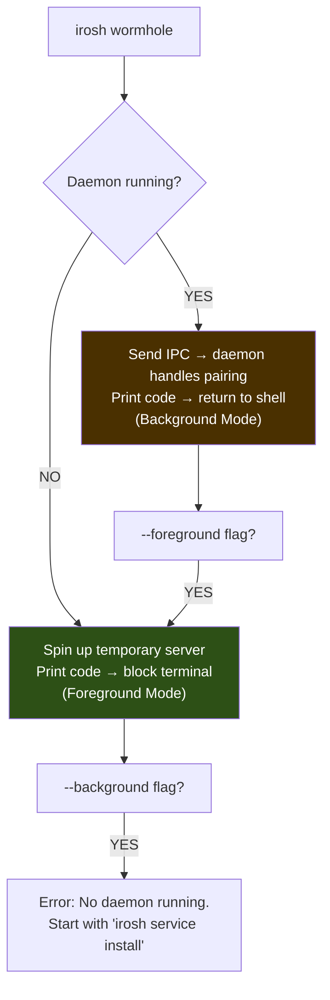

# Irosh: Complete User Flow Design

## The Two Personas

Every irosh interaction involves two machines:

- **Machine A** — "The Server": The machine you want to access remotely. Runs the irosh daemon in the background, permanently.
- **Machine B** — "The Client": The machine you're sitting at. Runs irosh ad-hoc to connect.

---

## Phase 1: Installation & Daemon Setup (Machine A)

```bash
# 1. Install the binary
curl -fsSL irosh.pages.dev/install | sh

# 2. Enable the background daemon (survives reboots)
irosh service install
```

`irosh service install` should:
- Create a **systemd user service** (Linux), **launchd plist** (macOS), or **Windows Service**
- Auto-start on boot
- Run headless with no TTY — all output goes to journal/syslog
- Listen for IPC commands on `~/.irosh/server/irosh.sock`
- Listen for P2P connections on the Iroh transport

```
✅ irosh daemon installed and running.
   Manage with: irosh service {start|stop|status|uninstall}
```

> [!NOTE]
> At this point, Machine A is online in the Iroh network but **no one can connect** — there's no ticket shared and no wormhole active. It's invisible.

---

## Phase 2: Pairing (One-Time)

This is the "Ticket Dance" that the wormhole solves.

### `irosh wormhole` Smart Routing

When you run `irosh wormhole`, the CLI auto-detects the right mode:

```
irosh wormhole [code] [--password X] [--foreground | --background] [--persistent]
```



**The rule is simple:**
- Daemon running → background by default (print code, return to shell)
- No daemon → foreground by default (print code, block until pairing)
- `--foreground` → force interactive mode even if daemon is running
- `--background` → force daemon mode (errors if daemon isn't running)

Either way, **the code is always printed.** That's the contract.

### Default Timer: 24 Hours

All ephemeral wormholes (foreground + background) expire after **24 hours** by default.

| Mode | Default Expiry | Override |
|:---|:---|:---|
| **Foreground** | 24h or Ctrl+C (whichever first) | `--timeout 2h` |
| **Background** | 24h or 1 successful pairing | `--timeout 48h` |
| **Persistent** | Never (survives reboots) | N/A |

**Why 24 hours:**
- DHT propagation can take 30-60 seconds, network issues can add minutes
- Real-world pairing often spans hours (set up server, walk to another room/office, get coffee)
- Short enough that forgotten wormholes don't linger indefinitely
- Pkarr TXT records have a 300s TTL and are re-published every 60s — the server simply stops re-publishing when the timer expires

### Option A: Foreground Wormhole (No daemon, or `--foreground`)

You're physically at Machine A:

```bash
irosh wormhole
```

```
✨ Wormhole Active (Foreground)
Code: crystal-piano-7
Expires: 24 hours (or 1 successful connection)

Run 'irosh crystal-piano-7' on the other machine.
Waiting for peer to knock...
```

**When a peer knocks:**
```
⚠️  Wormhole Pairing Request
A remote peer is attempting to pair with your machine.
Peer Fingerprint: SHA256:RCaypyuq7c0wmq7jzvbBl1TK7GN81eKpAeLRRHOJtz8
Do you want to authorize this peer? (y/n): y

✅ Peer authorized and key saved.
🔥 Wormhole burned. Future connections use standard auth.
```

**Security**: Interactive y/n confirmation. No password needed — you're watching.

### Option B: Background Wormhole (Daemon running, or `--background`)

The daemon is running, you just need to enable the wormhole:

```bash
irosh wormhole my-custom-code --password "s3cret"
```

```
✨ Wormhole Active (Background — daemon mode)
Code: my-custom-code
Security: Password-protected
Expires: 24 hours (or 1 successful connection)

The daemon will accept the first peer that provides the correct password.
Run 'irosh my-custom-code' on the other machine.
```

Your terminal is free. The daemon handles everything silently.

**Security**: Password is **mandatory** — compensates for lack of interactive confirmation.

### Option C: Persistent Wormhole (Lab/Homelab/IoT)

```bash
irosh wormhole lab-server --password "strong-pass" --persistent
```

```
✨ Wormhole Active (Persistent — survives reboots)
Code: lab-server
Security: Password-protected + rate-limited

This wormhole will remain active until explicitly disabled.
Disable with: irosh wormhole disable
```

**Security**: Password mandatory. Rate-limited (3 fails → 60s cooldown). No auto-burn.

---

## Phase 3: Connecting (Machine B)

```bash
# First time — using the wormhole code
irosh crystal-piano-7
```

```
🔮 Searching for wormhole: crystal-piano-7...
✨ Wormhole discovered!
🔗 Connecting to peer...
🔒 Trusted server key on first use.
✨ Auto-saved peer as 'kristency-linux'

kristency@ALPHA-01:~$
```

```bash
# Every time after — just use the alias
irosh kristency-linux
```

```
🔗 Connecting to kristency-linux...
🔒 Secure session established.

kristency@ALPHA-01:~$
```

---

## Phase 4: Day-to-Day

```bash
# List saved peers
irosh peer list

# Connect to a saved peer
irosh kristency-linux

# Transfer files
irosh kristency-linux put ./file.txt /tmp/
irosh kristency-linux get /var/log/syslog ./

# Check daemon status
irosh service status

# Manage wormholes
irosh wormhole              # Enable a new wormhole
irosh wormhole status       # Check if a wormhole is active
irosh wormhole disable      # Manually kill an active wormhole

# Add a new machine (another wormhole)
irosh wormhole
```

---

## Flow Summary

```mermaid
flowchart TD
    A[Install: curl ... | sh] --> B[Enable daemon: irosh service install]
    B --> C{How to pair?}
    
    C -->|"Sitting at machine"| D["irosh wormhole<br/>(foreground, interactive y/n, 24h)"]
    C -->|"Remote/headless"| E["irosh wormhole code --password X<br/>(daemon auto-detect, password, 24h)"]
    C -->|"IoT/homelab"| F["irosh wormhole code --password X --persistent<br/>(survives reboots, rate-limited, no expiry)"]
    
    D --> G[Client runs: irosh code]
    E --> G
    F --> G
    
    G --> H["✅ Paired!<br/>Peer saved as alias"]
    H --> I["Daily use:<br/>irosh alias"]
    
    style D fill:#2d5016,color:#fff
    style E fill:#4a3000,color:#fff
    style F fill:#4a0000,color:#fff
```

---

## Security Model per Mode

| | Foreground | Background | Persistent |
|:---|:---|:---|:---|
| **Who's watching?** | Human at TTY | No one | No one, ever |
| **Confirmation** | Interactive y/n | Password | Password |
| **Expiry** | 24h / Ctrl+C | 24h / 1 pairing | Never |
| **Auto-burn** | After 1 pairing | After 1 pairing | No |
| **Rate limiting** | N/A (human confirms) | 3 strikes → burn | 3 strikes → 60s cooldown |
| **Password required?** | No | Yes | Yes |
| **Code generation** | Auto (random) | Auto or custom | Custom only |

---

## Current Implementation Gaps

| Feature | Expected | Current Status |
|:---|:---|:---|
| `irosh service install` (systemd) | Creates & enables service | ❌ Not implemented |
| Smart routing (auto-detect daemon) | IPC if daemon, foreground if not | ⚠️ Separate code paths exist, no auto-detect |
| Foreground wormhole with y/n prompt | Interactive confirmation | ⚠️ CLI sets it up, server overwrites it |
| Background wormhole (daemon mode) | Password-mandatory, no TTY | ✅ Works via IPC |
| Persistent wormhole | Survives reboot, no auto-burn | ❌ `persistent` flag is a no-op |
| 24-hour default timer | Expiry after 24h | ❌ No timer exists (prints fake "5 minutes") |
| `--timeout` override | User-configurable expiry | ❌ Not implemented |
| Rate limiting | 3 strikes → cooldown/burn | ❌ Not implemented |
| Auto-burn on success | Kill wormhole after 1 pairing | ✅ Implemented |
| Alias auto-save | Save peer after successful pairing | ✅ Implemented |
| `irosh wormhole status` | Check if wormhole is active | ❌ Not implemented |
| `irosh wormhole disable` | Manually kill active wormhole | ⚠️ IPC command exists, no CLI subcommand |

